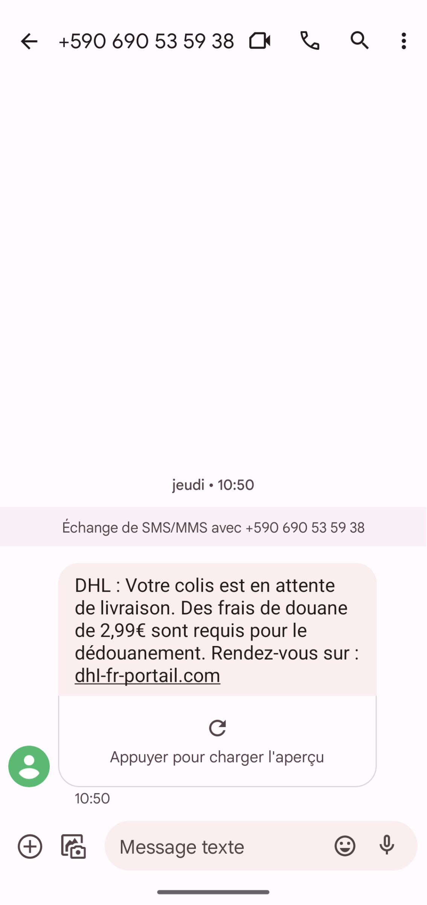
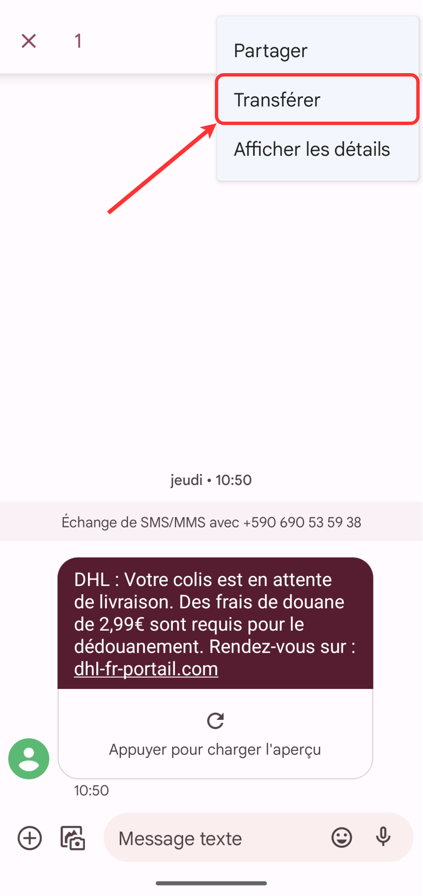
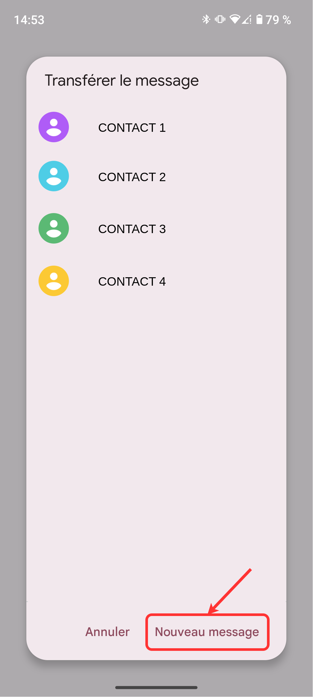
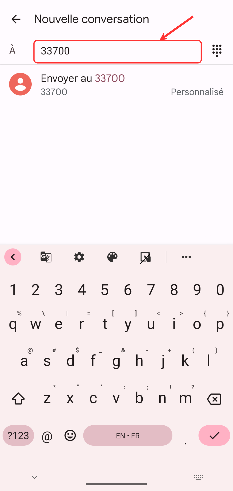
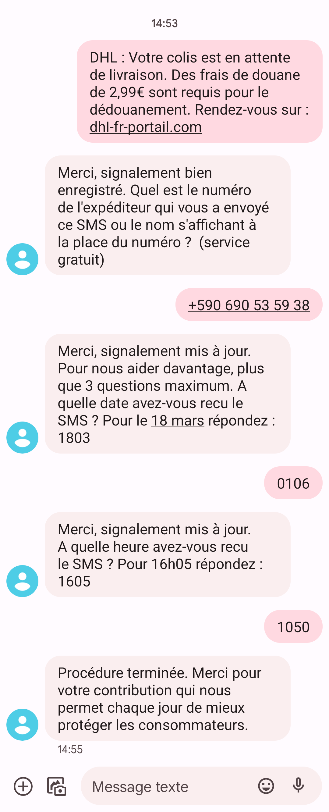

Le numéro 33700 détenu par l'[Association française du multimédia mobile](https://af2m.org/) est le numéro français pour signaler les SMS frauduleux.

Quand vous recevez un SMS frauduleux, vous pouvez le signaler via le site de 33700 à [cette adresse](https://www.33700.fr/signaler-form-pc/), ou vous pouvez transférer le SMS au [33700](tel:+33700).
Voici comment procéder :

Faites un appui long sur le message en question :

Une fois le message sélectionné, cliquez sur les trois petits points en haut à droite puis cliquez cliquez sur **Transférer** :

Choisissez **Nouveau message** :

Puis tapez le numéro [33700](tel:33700) :

Suivez le reste de la procédure :

Le SMS sera remonté aux autorités.

> Le gouvernement français mets en place un [filtre anti-arnaque](https://www.service-public.fr/particuliers/actualites/A16425), qui devrait être disponible pour le grand public courant 2024. On espère que cela fonctionnera 🤞️.
