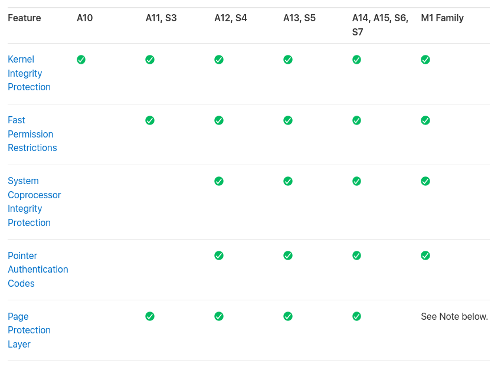
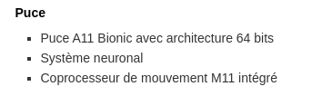
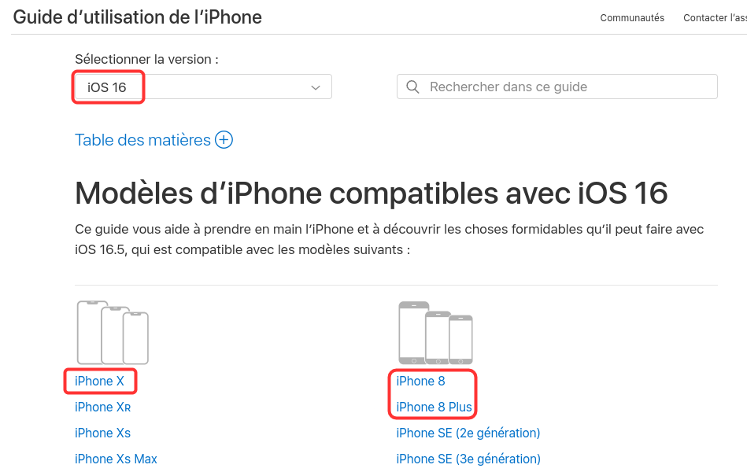

Je voudrais m'attarder sur cette histoire de durée de vie des iPhones qui commençait à me trotter à la tête depuis un certain temps.

Je vais ici, discuter de la durée pendant laquelle Apple propose des mises à jour de sécurité pour ses smartphones (le support logiciel), plutôt que de la longévité physique du téléphone ou de la fréquence de bug au fil du temps.

Apple met à jour sur une base régulière leurs smartphones mais la question à 1 million subsiste : 

"Combien de temps Apple va supporter mon super smartphone ostentatoire ?"

Apple ne donne pas de date concernant l'EOL (End Of Life, autrement appelé la "fin de vie" en français) concernant leurs smartphones. On ne peut donc qu'estimer la date butoir de ces objets de luxe.

Dans une [page de la documentation](https://support.apple.com/fr-fr/guide/deployment/depc4c80847a/web) d'Apple, on retrouve cette remarque :

> Remarque : en raison de la dépendance vis-à-vis des changements au niveau de l’architecture et du système apportés à une version actuelle du système dʼexploitation dʼApple (par exemple, macOS 13, iOS 16, ainsi de suite), les problèmes de sécurité connus ne sont pas tous corrigés dans les versions antérieures (par exemple, macOS 12, iOS 15, ainsi de suite).

Apple donc arrête le support régulier des corrections de sécurité (ce qui est le plus important) après la sortie d'une nouvelle version iOS. C'est donc pour cela que l'iPhone 6 qui n'est plus mis à jour pendant des années se retrouve quand même avec une correction par-[ci](https://support.apple.com/en-us/HT212341), par-[là](https://support.apple.com/en-us/HT212548) et encore [là](https://support.apple.com/en-us/HT213597) (et j'en passe), avec des semaines voire des mois d'écart.

Si votre iPhone est compatible avec la nouvelle version iOS, vous êtes tranquille. Mais le jour où votre iPhone ne peut plus être mis à niveau vers une version supérieure (exemple : de iOS 16 vers iOS 17) alors vous êtes fichu, car vous ne pouvez pas compter sur des futures mises à jour hypothétiques tandis que les failles de sécurité seront rapidement révélées au grand jour.

Je pense qu'il est donc raisonnable d'admettre qu'un iPhone se voit son support arrêté le jour où il ne peut plus passer à une version supérieure d'iOS.

## System on Chip

Les SoC d'Apple fournissent différents protocoles de sécurité qui sont visibles sur [leur site](https://support.apple.com/fr-fr/guide/security/sec87716a080/web). On peut facilement en déduire qu'il faut au minimum utiliser les iPhones possédant les puces A12 et plus.

Pour savoir quel iPhone possède quel SoC, vous pouvez taper le nom de la puce sur Wikipedia, voici [le résultat](https://fr.wikipedia.org/wiki/Apple_A12_Bionic) pour la puce A12 :

- iPhone XS et XS Max
- iPhone XR
- iPad Air 3
- iPad mini 5
- iPad (8e génération)
- Apple TV 4K (2021)

Constatez que l'[iPhone X](https://support.apple.com/kb/SP770?locale=fr_FR) manque à l'appel car il possède une puce A11 à l'instar de l'[iPhone 8](https://support.apple.com/kb/SP767?viewlocale=fr_FR&locale=fr_FR) et [8 Plus](https://support.apple.com/kb/SP768?viewlocale=fr_FR&locale=fr_FR).

- iPhone 8 :

- iPhone X :

On peut également noter qu'iOS 16 était supporté pour l'iPhone 8/8 Plus et l'iPhone X et qu'iOS 17 [les abandonne](https://support.apple.com/fr-fr/guide/iphone/iphe3fa5df43/17.0/ios/17.0).

**iOS 16**

L'arrêt du support de ces deux téléphones coïncident avec la puce utilisée.

Les iPhones 6s, 6s Plus et le SE de 1ère génération utilisaient la puce A9 et l'iPhone 7 et 7 Plus utilisaient la puce A10. Ils ont tous les deux en même temps à partir d'[iOS 16](https://support.apple.com/fr-fr/guide/iphone/iphe3fa5df43/16.0/ios/16.0).

Alors, il y a pas grand à chose de retenir de ça à part qu'on peut remarquer que les mises à jour s'arrêtent pour tous les appareils utilisant la même puce.

Cela veut dire que les smartphones utilisant la puce A12 ont de fortes chances d'être abandonnés d'ici les nouvelles versions d'iOS (peut-être iOS 18 ou 19 qui sait). Voici la liste des iPhones concernés :

- iPhone XS
- iPhone XS Max
- iPhone XR

## Mais combien de temps pourrais-je garder mon précieux ?

J'ai surtout exposé deux ou trois informations que j'ai réussi à trouver sur le site d'Apple, mais aucune information sur combien de temps sont supportés leurs téléphones.

Basé sur les informations que j'ai réussi à récolter, c'est à dire :

- On considère que le smartphone est EOL lorsqu’il ne peut plus être mis à niveau vers une version supérieur d'iOS puisque les mises à jour de sécurités sont uniquement partielles.
- Les arrêts de support des iPhones semblent coïncider avec la puce utilisée. Ce qui veut dire que tous les appareils utilisant la même puce sont EOL.

Si on reprend les iPhones à partir du 6 (choix arbitraire), voici les durées de vie de chacun :

- iPhone 6 et 6 Plus sont actuellement bloqué à la version 12.5.7, ils ne sont pas passés à iOS 13.

**Durée de vie :** septembre 2014 à [septembre 2019](https://www.apple.com/newsroom/2019/06/apple-previews-ios-13/ (date de sortie d'iOS 13). Soit **5 ans** de support.

- iPhone 6s, 6s Plus et SE 1ère génération sont actuellement bloqués à la version 15.7.9, ils ne sont pas passés à iOS 16.

**Durée de vie :** septembre 2015 à [septembre 2022](https://www.apple.com/fr/newsroom/2022/09/ios-16-is-available-today/) (date de sortie d'iOS 16). Soit **7 ans** de support.
- iPhone 7 et 7 Plus sont actuellement bloqués à la version 15.7.9.

**Durée de vie :** septembre 2016 à [septembre 2022](https://www.apple.com/fr/newsroom/2022/09/ios-16-is-available-today/) (date de sortie d'iOS 16). Soit **6 ans** de support.
- iPhone 8, 8 Plus et iPhone X sont actuellement bloqué à 16.7 (mise à jour en septembre 2023) mais [ne passeront pas à iOS 17](https://support.apple.com/fr-fr/guide/iphone/iphe3fa5df43/17.0/ios/17.0)

**Durée de vie :** septembre 2017 à [septembre 2023](https://www.apple.com/fr/newsroom/2023/09/ios-17-is-available-today/) (date de sortie d'iOS 17). Soit **6 ans** de support.

> Actuellement, nous sommes plutôt sur un [mode](https://fr.wikipedia.org/wiki/Mode_(statistiques)) (valeur dominante en statistique) de 6 ans.

Si nous considérons que les iPhones encore supportés suivent cette tendance, tout iPhone possédant la puce A12 seront potentiellement abandonné en septembre 2024. Les iPhones concernés sont donc les suivants :

- iPhone XS 
- iPhone XS Max
- iPhone XR

Puis, concernant la puce A13, donc l'iPhone 11, 11 Pro & 11 Pro Max et iPhone SE (2nd Gen). Ils seront potentiellement abandonnés en septembre 2025, ce qui leur feront un total de 6 ans de durée de vie puisque ces iPhone sont sortis en septembre 2019.

## Prix réels

Oui les iPhones sont chers, on sera d'accord. Cependant, regardons un peu les prix par rapport à la durée de vie des iPhones.

Prenons l'iPhone 15 pour exemple qui est actuellement à 969€ sur le site marchand à l'heure où j'écris ces lignes (septembre 2023). Si vous l'achetez à ce prix au mois de septembre 2023, vous payez 969€ sur les 6 années (potentielles) de support qui reste à l'iPhone puisqu'on nous avons déduit plus tôt que la moyenne se situait à 6 ans.

Vous payez donc 969€/(6x12)=**13.45€/mois** pour l'iPhone 15.

Si nous comparons maintenant avec Samsung, la marque propose [5 années de mises à jour](https://security.samsungmobile.com/securityPost.smsb) de sécurité à partir des Samsung S22. On peut actuellement trouver le Samsung S23 à 850€ sur Amazon (donc ~170€ moins cher que l'iPhone 15). Si vous achetez le Samsung S23 en septembre 2023, vous payerez 850€ sur 4 ans et demi (car le S23 est sorti en février 2023, cela fait donc 7 mois).

Vous garderez votre téléphone 4 ans et 5 mois.

Vous payez donc 850€/(4x12+5)=**16.03€/mois** pour le Samsung S23

Oui, vous payez plus cher votre Samsung sur ces 5 ans comparé à l'iPhone 15 car il ne fournit des mises à jour que pendant 5 ans.

## Conclusion

Vous vous dites peut-être que vous pouvez de toute façon garder votre smartphone plus longtemps. Mais rappelez-vous une chose : une fois le support des mises à jour de sécurité terminé, les prochaines failles publiques ne seront pas corrigé !

Je vous conseille personnellement de changer votre téléphone sous deux raisons.
	- Votre téléphone est tellement cassé ou inutilisable qu'il est plus cher à réparer que le prix du téléphone lui-même.
	- Votre téléphone est en fin de support et ne recevra plus de mise à jour de **sécurité**.

Avec ces raisons, tous ces petits calculs que je vous ai montré prennent tous leurs sens.

Voici l'extrait d'un interview (en anglais) entre un Youtubeur et un membre du projet GrapheneOS portant sur les firmwares et pourquoi changer de téléphone même si le vôtre fonctionne.

