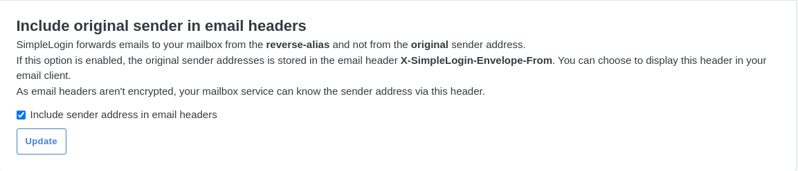
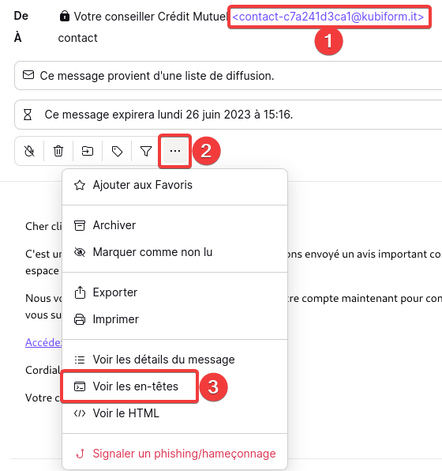
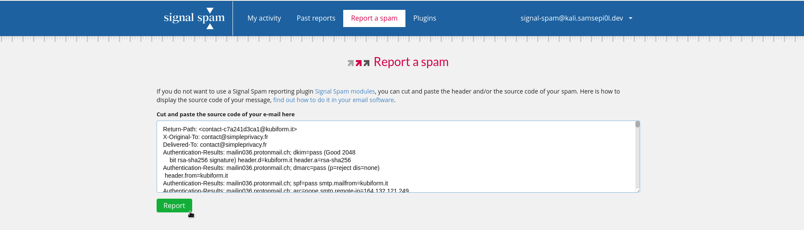

Si vous souhaitez arrêter de recevoir des spam, je vous conseille d'utiliser [SimpleLogin](https://simplelogin.io/fr/) ou [AnonAddy](https://anonaddy.com/). Ce sont des services d'aliasing qui vous permettent de créer plein d'adresses mail dis "alias", c'est à dire que les tous les mails que vous recevrez sur ces alias vont en fait être redirigés vers votre boîte mail principale (Gmail, Proton Mail, Outlook, etc...).

L'avantage dans ces services et de pouvoir toujours protéger votre adresse mail principale en la cachant systématiquement aux sites web sur lesquels vous vous connecterez. Puisque, quand vous donnez un alias à un site web, il ne peut pas connaître votre adresse originel. Si ce site vous envoie trop de mail, vous pouvez soit bloquer le contact dans SimpleLogin, désactiver ou supprimer l'alias.

Cependant, les mails seront toujours reçus (mais vraiment limités grâce au fonctionnement des services d'aliasing). Je vous propose de changer vos habitudes.

Au lieu de supprimer le mail ou le mettre dans la boîte de spam, je vous propose de le signaler à [Signal Spam](https://www.signal-spam.fr/).

Signal Spam est une association française loi de 1901 qui a pour but d'agir contre le spam. Vous pouvez signaler un mail frauduleux en faisant un copier/coller des en-têtes du mail.

---

Si vous utilisez SimpleLogin, cochez cette option (et cliquez sur "**Update**") :

> Normalement, quand vous recevez un mail venant d'un de vos alias, l'envoyeur du mail sera le dit-alias et non le mail originel. En activant cette option, vous pourrez voir qui a envoyé le mail à l'origine. Cela a pour conséquence que votre fournisseur de mail (Gmail, Outlook, Proton, etc.) sera en mesure de voir qui a envoyé le mail. Activez ou non selon votre [modèle de menace](https://simpleprivacy.fr/basiques/threat-model). Ne signalez **pas** le mail à Signal-Spam si vous avez décochez l'option !

---

Sur votre boîte mail, vous devez cliquer sur un bouton "**Voir le mail originel**" ou "**Voir l'en-tête du mail**". Signal Spam explique comment procéder pour la plupart des clients mail [ici](https://www.signal-spam.fr/trouver-code-source/) (en bas de leur page).


Je vous déconseille d'installer leurs extensions sur votre navigateur. Évitez d'augmenter votre surface d’attaque en installant pléthore d'extensions pour telle ou telle raison.


Sur Proton Mail, voici les étapes à suivre :

- **(1)** - On peut voir que j'ai reçu un mail frauduleux, c'est certain que Crédit Mutuel n'utilise pas ce genre d'adresse mail pour nous informer de problèmes de sécurité.
- **(2)** - Cliquez sur "**...**"
- **(3)** - Cliquez sur "**Voir les en-têtes**".

Copiez les en-têtes puis allez sur [Signal-Spam.fr](https://www.signal-spam.fr/). Créez-vous un compte et vous arriverez sur cette page (sinon cliquez sur "**Report a spam**" en haut) :

Collez les en-têtes dans le champ de texte puis cliquez sur "**Report**"

*Vous pouvez ensuite voir vos précédents signalements en allant sur l'onglet "**Past Reports**"*

Maintenant, vous savez comment signaler un mail frauduleux ! 😎️

Si vous avez d'autres questions concernant Signal-Spam, vous pouvez visiter leur [FAQ](https://www.signal-spam.fr/foire-aux-questions/).
