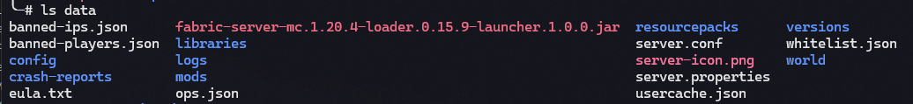

Vous souhaitez jouer avec un ami, mais ne savez pas comment créer un serveur Minecraft ? Je vais vous guider pour que vous puissiez jouer sur un serveur avec vos amis sans que des petits malins puissent s'y connecter.

Je préfère jouer en vanilla, les mods qui sont installés dans ce guide n'auront pas ou très peu d'impact sur l'expérience de jeu. Ils sont avant tout installés pour améliorer les performances de jeu.

## Prérequis

- Savoir utiliser un système Linux
- Connaissances basiques de Docker, docker compose et des conteneurs
- Savoir se connecter en SSH avec des clés
- Posséder une paire de clé SSH (suivre [cet article](https://wonderfall.space/retour-du-root-ssh/#sur-des-machines-distantes-mon-h%C3%A9ros-ssh-et-comment-je-lutilise) pour en générer une)

### VPS

Un serveur Minecraft n'est pas très demandant en ressources, le VPS `VLE-2` (~5.50€/mois) proposé [chez OVH](https://www.ovhcloud.com/fr/vps/) devrait être suffisant si vous êtes moins de ~5 joueurs.

### Système d'exploitation

Pour le système d'exploitation, j'ai choisi Fedora Server, il est conseillé d'utiliser ce système car certaines configurations dans ce guide sont spécifiques aux distributions basés sur Red Hat Entreprise Linux.

## Sécurisation SSH

En tout premier lieu, vous allez sécuriser la connexion à votre serveur.

Je me suis basé sur [les configurations systèmes de GrapheneOS](https://github.com/GrapheneOS/infrastructure), parce que je sais qu'elles sont fonctionnelles, propres et sécurisées. Cela me permet de me concentrer uniquement sur la configuration de mes applications. En ce qui concerne la sécurisation du système, je fais confiance au personnes du projet qui font un travail plus que sérieux en terme de sécurité, je copie donc les configurations système que propose le projet GrapheneOS.

Copiez le contenu de [ce fichier](https://github.com/GrapheneOS/infrastructure/blob/main/etc/ssh/sshd_config) et collez-le dans `/etc/ssh/sshd_config` (remplacez la totalité du contenu par la configuration de GrapheneOS).


Concernant cette configuration SSH, vous devrez **impérativement** :

- Posséder une paire de clé de type **ED25519**.
- Mettre votre clé publique dans le fichier `/root/.ssh/authorized_keys`
- Changer la variable `MaxAuthTries` à `3` au lieu de `1` dans le fichier `/etc/ssh/sshd_config` au cas où vous faites une erreur pour je ne sais quelle raison.
- Changer la variable `AllowUsers` à `root` au lieu de `{{ssh_users}}` dans le fichier `/etc/ssh/sshd_config` (puisque vous vous connecterez au serveur via l'utilisateur root).


Une fois les configurations enregistrés, redémarrez le service `sshd` :

```bash
systemctl restart sshd
```

Vérifiez **bien** que vous pouvez vous connecter sans soucis à votre machine avant de passer à la suite.

## Installation Fedora

Si vous avez choisi Fedora comme système, il est possible que la version donné par OVH soit la précédente version, il est préférable de mettre à jour vers la dernière version de Fedora.

Suivez [ce guide](https://docs.fedoraproject.org/en-US/quick-docs/upgrading-fedora-offline/) pour mettre à jour Fedora.

<!-- TODO -->
<!-- ## Sécurisation du système -->

## Installation docker

Pour installer docker, suivez la [procédure officielle d'installation](https://docs.docker.com/engine/install/fedora/).

Puis activez et démarrez le service docker (afin qu'il persiste après un redémarrage du serveur).

```bash
systemctl enable --now docker
```

## Configuration de docker-compose.yml

J'ai créé un dépôt pour héberger l'ensemble de ma configuration, vous pouvez y jeter un œil sur [GitHub](https://github.com/d4rklynk/minecraft-server-infrastructure).

Créez un dossier `minecraft` dans `/opt` :

```bash
mkdir /opt/minecraft
```

Ouvrez un nouveau fichier avec `vim` ou `nano` que vous nommerez `docker-compose.yml` :

```bash
vim /opt/minecraft/docker-compose.yml
```

Collez ensuite le contenu présent dans [mon fichier docker-compose.yml](https://raw.githubusercontent.com/d4rklynk/minecraft-server-infrastructure/main/docker/opt/minecraft/docker-compose.yml) dans le fichier que vous venez de créer.

Vous pouvez également directement télécharger ma configuration comme ceci :

```bash
curl https://raw.githubusercontent.com/d4rklynk/minecraft-server-infrastructure/main/docker/opt/minecraft/docker-compose.yml > /opt/minecraft/docker-compose.yml
```

Si besoin, modifiez à votre guise. Les mods que j'ai installé sont uniquement présent pour les performances du jeu.

Vous pouvez lancer le serveur via cette commande :

```bash
docker compose up -d
```

Puis, vérifiez que tout se passe bien :

```bash
docker logs -f minecraft
```

Avant de pouvoir commencer à jouer, il reste le fichier `server.properties` à mettre en place.

## Configuration de server.properties

Une fois le monde Minecraft accessible et fonctionnel, vous devriez avoir un dossier `data` à côté du fichier `docker-compose.yml`. Les données du serveur et de votre monde sont dans ce dossier.



Ouvrez le fichier `server.properties` :

```bash
vim /opt/minecraft/data/server.properties
```

Vérifiez que les lignes suivantes soient configurées comme ci-dessous :

```text
enable-rcon=false
enforce-secure-profile=true
enforce-whitelist=true
max-players=3 (mettez le nombre de joueurs maximum qui se connecteront à votre serveur)
white-list=true
```

Si l'une de ces lignes n'existe pas, rajoutez-la.

Vous devrez ajouter les nouveaux joueurs via la commande `/whitelist <nomdujoueur>` dans la console Minecraft (dans le jeu) et le fichier `whitelist.json` se mettra automatiquement à jour.

Pour finir, redémarrez le serveur Minecraft pour mettre en place les configurations.

```bash
docker compose down && docker compose up -d
```

Si vous n'arrivez pas à accéder au jeu car vous n'êtes pas dans la whitelist, tapez la commande suivante :

```bash
docker exec minecraft mc-send-to-console whitelist add votrepseudo
```

Votre serveur est maintenant opérationnel !


*[Source de l'image](https://giphy.com/gifs/minecraft-microsoft-builder-minecraft-74oBQ5O5aJVv9t7Xuc)*

## Sources

- <https://docs.docker.com/engine/install/fedora/>
- <https://docker-minecraft-server.readthedocs.io/en/latest/>
- <https://github.com/GrapheneOS/infrastructure/tree/main/ssh>
- <https://minecraft.wiki/w/Server.properties>
